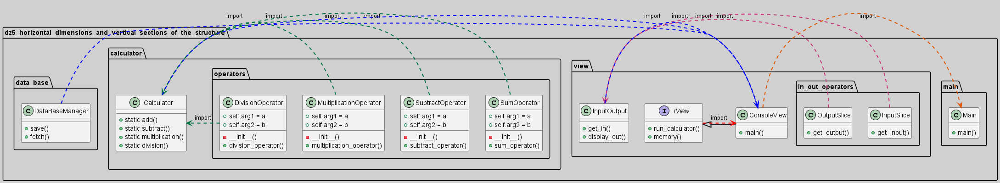

Приложение разбито на 3 горизонтальных слоя и точку входа:

1. data_base (работа с памятью)
2. calculator (основная логика)
3. view (пользовательский интерфейс для работы с программой)

Вертикальные срезы можно проследить по стрелочкам

Как можно заметить, некоторые методы вместо прямого выполнения решения, вызывают отдельный класс, который выполняет логику работу.
Это позволяет сделать код более поддерживаемым и более гибким к изменениям в будущем, если потребуются.
Так же это позволяет ускорить разработку приложения,
потому что позволяет большой модуль разбить на модули поменьше, чтобы команды разрабатывали их параллельно и независимо друг от друга.
